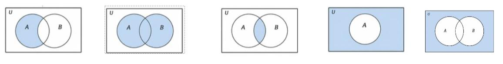



## Topics covered

```{=latex}
\footnotesize
```

- **Mathematical modeling components:** variables, parameters,
  constraints and assumptions.

- **Sets and algebra:** set notation, intervals, standard number sets,
  algebraic expressions, equations, and inequalities.

- **Proof techniques:** propositions, quantifiers, implications,
  necessary and sufficient conditions, five techniques of proofs:
  direct, contrapositive, by contradiction, by induction, and by
  counterexample.

**To be completed before class:** the first two topics of mathematical
  modelling, sets and algebra. (Material on the course site)

**To be developed in class:** proof techniques.

**Course site:**
  [khaledfouda.github.io/MATH40604/](https://khaledfouda.github.io/MATH40604/).
  It contains all the course material needed for the English course.
  Since this is a new course, the material is work-in-progress and will
  be uploaded weekly.


**Learning objectives.** By the end of the session, you should be able
to:

- state clearly the components of mathematical model;
- translate a real-life problem into mathematical expressions and
  constraints;
- manipulate algebraic expressions and represent domains using sets;
- Interpret quantifiers, implications, and logical conditions;
- select an appropriate proof technique and write a simple and
  structured \textbf{Proof.}

## Today


**Part 0.** Introductions

**Part 1.** Review of the pre-session activities.

**Part 2.** Proof techniques

**Part 3.** Tutorial session


# Review of pre-class material

## Mathematical modeling (Example) 

```{=latex}
\footnotesize
```

We consider the market for a homogeneous good. The quantity demanded
depends on the price $p$ of the good and on consumers' income $y$:


$$q_D = a - bp + cy, \qquad \text{where  } a,\, b,\, c > 0 .$$

Supply is assumed fixed and equal to $q_S$; 
Determine the equilibrium price in the market for this good.

```{=latex}
\scriptsize
\renewcommand{\arraystretch}{1.25}
\begin{center}
\begin{tabular}{|p{2.1cm}|p{4.3cm}|p{6.0cm}|}
\hline
\textbf{Component} & \textbf{Description} & \textbf{Example} \\
\hline
Variables &  &  \\[3mm]
\hline
Parameters & &  \\[3mm]
\hline
Relationships or constraints & & \\[3mm]
\hline
Objective & & \\[2mm]
\hline
Assumptions & & \\[2mm]
\hline
\end{tabular}
\end{center}
```

## Describing a set

```{=latex}
\footnotesize
```


**Convert each of the following to a set representation**

```{=latex}
\footnotesize
\begin{enumerate}\setlength{\itemsep}{0pt}
\item $A = ( -\infty,\, 5 ]$. (property) \ans[4]
\item $B = \{\, x \in \R \mid 1 < x \le 4 \,\}$. (interval) \ans[4]
\item The observation space of a dataset where each observation is described by
      four non-negative numerical variables. (property) \ans[4]
\item A machine must produce a part of length $50$ mm with a tolerance of $3$ mm.
      Describe the admissible set. (interval/property) \ans[4]
\item A risk score $s$ must remain within a maximum distance of $0.2$ from a
      target equal to $0.7$. Describe the admissible set. (interval/property) \ans[4]
\item Consider a vector of proportions $\vect{x} = (x_1, \dots, x_n)$. Each
      component is non-negative and the sum of the components is equal to $1$.
      Describe the admissible set. (interval/property) \ans[4]
\end{enumerate}
```

## Sets and Summations 

```{=latex}
\footnotesize
Consider the following weights and scores:
$$\vect{w} = (0.2,\, 0.5,\, 0.3), \qquad \vect{z} = (70,\, 80,\, 90).$$

\begin{enumerate}\setlength{\itemsep}{0pt}
\item  Verify that $\vect{w}$ belongs to the simplex
    $\bigl\{\, \vect{w} \in \Rp^{3} \mid \sum_{j=1}^{3} w_j = 1 \,\bigr\}$.
 \ans[4]
\item  $\simplex{3}$ is a subset of which space (or universe)?
 \ans[4]
\item Compute the weighted score $S = \sum_{j=1}^{3} w_j z_j$.
 \ans[4]
\item Is the vector $\widetilde{\vect{w}} = (0.4,\, 0.8,\, -0.2)$
    admissible? Justify.
 \ans[4]
\item Explain why $S$ lies between the smallest and the largest score when
    $\vect{w} \in \Delta^{3}$.
 \ans[4]
\end{enumerate}

```

## Set Operations

Determine the operation that describes the blue shaded region in each
diagram and present the formulas that compute the cardinality of each
resulting set.

{width="100%"}

## Partition of a Universe

1. Give a mathematical definition of a partition of the universe
  $U$. (3 conditions)

2. Construct a nontrivial example of a partition of a universe of your choice and verify that it satisfies the conditions.


# Quantifiers 

## Quantifiers $(\forall,\, \exists,\, \exists!)$

```{=latex}
\footnotesize

\begin{itemize}
\item $\mathbf\forall$: \\
\ans[1]
Example: $\forall x \in \R,\ x^2 \ge 0$.

  \ans[4]

\item $\mathbf\exists$: \\
\ans[1]
  Example: $\exists\, x \in \R$ such that $x^2 = 4$.
\ans[4]

\item $\mathbf\exists!$: \\
\ans[1]
  Example: $\exists!\, x \in \R$ such that $x + 3 = 5$.

\ans[4]
  \end{itemize}
```

## Note: the order of quantifiers matters

```{=latex}
\footnotesize

\begin{itemize}
\item $\forall x \in A$ such that $P(x)$: \ans[5]

\item $\exists x \in A$ tel que $P(x)$: \ans[5]
\end{itemize}

\textbf{Which of these propositions are true?}
\begin{itemize}
\item $\forall x \in \R,\ \exists y \in \R$ tel que $y > x$.
\ans[5]
\item $\exists y \in \R$ tel que $\forall x \in \R,\ y > x$.
\end{itemize}
```

## Families of Sets

Let $(A_i)_{i \in I}$ be a family of sets indexed by an index set $I$.

Complete the following equivalences using the quantifiers $\exists$ and $\forall$:
$$x \in \bigcup_{i \in I} A_i \iff \dots$$ and
$$x \in \bigcap_{i \in I} A_i \iff \dots$$

# Implications

## Implications

**$P \implies Q$**

- $P$ implies $Q$
- If $P$ is true, then $Q$ is true
- $P$ is a sufficient condition for $Q$
- $Q$ is a necessary condition for $P$

**$P \iff Q$**

- Both $P \implies Q$ and $Q \implies P$ hold
- $P$ is a necessary and sufficient condition for $Q$ (and vice versa)
- $P$ is true if and only if (iff) $Q$ is true


## Implications: Example

```{=latex}
\footnotesize

Consider the following two propositions:
\begin{itemize}
\item $P$: The person resides in Montreal.
\item $Q$: The person resides in Quebec (the provice).
\end{itemize}

Translate each statement into symbolic form (using $P$, $Q$, $\Rightarrow$, and $\Leftrightarrow$) and determine whether the statement is true  it is true or false. 

\begin{enumerate}
\item  Residing in Montreal is a sufficient condition for residing in  Quebec. 
\ans[3]\item  Residing in  Quebec is a necessary condition for
    residing in Montreal.
\ans[3]\item  Residing in Quebec is a sufficient condition for
    residing in Montreal. 
\ans[3]\item  Residing in Montreal is a necessary condition for residing in  Quebec. 
\ans[3]\item  Residing in Montreal is a necessary and sufficient condition for
    residin in Quebec. 
\end{enumerate}
```

## Proof techniques

## Proof techniques


We use a mathematical proof to verify that a conclusion truly follows
from the hypotheses. As readers, proofs let us trust results we didn't come up with, and as writers, proofs is how we convince readers (reviewers) that our results make sense.

Typically, a proof include the following steps: 

- Identify the hypotheses (what we assume to be true) and the universe (admissible set(s)) in which the object(s)
  are defined.
- Clearly state the conclusion to be proved.
- Construct a sequence of justified (valid) implications based on the
  hypotheses, definitions, and previously established results.
- Explicitly conclude that the required proposition has been proved.

# Proof technique 1. direct proof

## 1. Direct Proof {.t}

```{=latex}
\footnotesize

We start from the hypotheses and reach the conclusion:
$$\text{hypotheses} \implies \text{logical steps} \implies \text{conclusion}.$$

\textbf{Example.} Let $n \in \Z$. Show that if $n$ is even, then $n^2$ is
even.

\textbf{Proof.}

```

# Proof technique 2. proof by contrapositive

## 2. Proof by Contrapositive {.t}

```{=latex}
\footnotesize

To prove $P \Rightarrow Q$, we can prove that if $Q$ is false, then $P$
is false.

$$(P \Rightarrow Q) \iff (\text{No } Q \Rightarrow \text{No } P)$$


\textbf{Example.} Let $n \in \Z$. Show that if $n^2$ is even, then $n$ is
even.

\textbf{Proof.}
```

# Proof technique 3. proof by contradiction

## 3. Proof by Contradiction {.t}

```{=latex}
\footnotesize

In contradiction, we show that the alternative is false. We want to show that $P \implies Q$ which means that if $P$ is true, then $Q$ is true. In this technique, we begin the proof by assuming that $P$ is true and that $Q$ is false. Then we show that our assumption is false. If our assumption is false, then it must be that $P \implies Q$ holds.


\textbf{Example (the pigeonhole principle).} Suppose that $n$ items are
put into $m$ containers, with $n > m$, then at least one container must contain more than one item.

\textbf{Proof.}
```

# Proof technique 4. proof by induction

## 4. Proof by Mathematical Induction (1) {.t}

```{=latex}
\footnotesize

In mathematical induction, we show that our statement is true for every admissible number (or case) in the universe (universal set). This is done by first proving a simple case, then we condition on it to prove the next case. This informal metaphor taken from Wikipedia help explain the concept
\ans[3]
\begin{quote}\small\itshape
Mathematical induction proves that we can climb as high as we like on a ladder,
by proving that we can climb onto the bottom rung (the basis) and that from each
rung we can climb up to the next one (the step).

\upshape\raggedleft\textemdash\ \emph{Concrete Mathematics}, page 3 margins.
\end{quote}

Assume that we want to show that the statement $P(n)$ hold in the universe $N_0 = \{n\in \N | n \ge n_0 \}$ for some $n_0 \in \N$.
The steps of a mathematical induction proof are:

\begin{itemize}

\item \textbf{Base case.} We first show that the first case is true. That is, $P(n_0)$ holds.

\item \textbf{Induction step.} We prove that if the statement hold for any $k \in N_0$, then it holds for  $k+1$, as long as $(k+1) \in N_0$. That is,  $\forall k \in N_0, P(k) \implies P(k+1)$


\end{itemize}
\ans[1]
Generally in induction, our universe will be the set of positive integers starting at either $0$ or $1$, which means that the base case is either $n=0$ or $n=1$ and that $k+1$ always belong to the universe.
```


## 4. Proof by Mathematical Induction (2) {.t}

```{=latex}
\footnotesize


\textbf{Example.} Prove that $\forall n \in \N^{*}$, the statement
$P(n)\colon=\sum_{j=1}^{n} j = \dfrac{n(n+1)}{2}$ holds, where $\N^{*}$ denotes the set
of positive integers.

\textbf{Proof.}
```

# (Dis)Proof technique 5. Counterexample 

## 5. Disproof by Counterexample {.t}

```{=latex}
\footnotesize

Assume that we want to show that the statement $\forall x \in E, P(x)$ does not hold, for some set $E$. It is sufficient to find one element $x_0 \in E$ for which $P(x_0)$ is false to disprove the whole statement. That is,  

$$ \bigl( \forall x \in E,\ P(x) \bigr) \text{ is false } \iff \exists\, x_0 \in E \text{ such that } P(x_0) \text{ is false}.$$

\textbf{Example.} Disprove the statement $\forall x \in \R,\ x^2 > x$.

\textbf{Proof.}
```


# Summary

## Before next class


- Review the material and practice the tutorial exercises. 
- Prepare for the next session by reading pre-class notes of Session 2.


