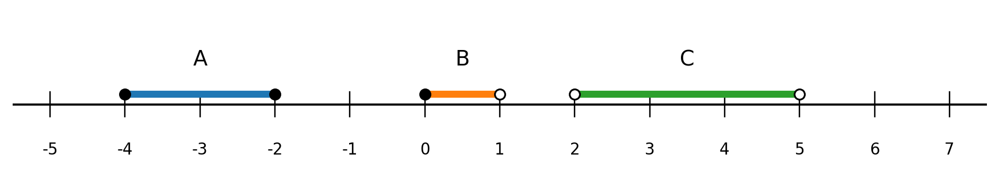
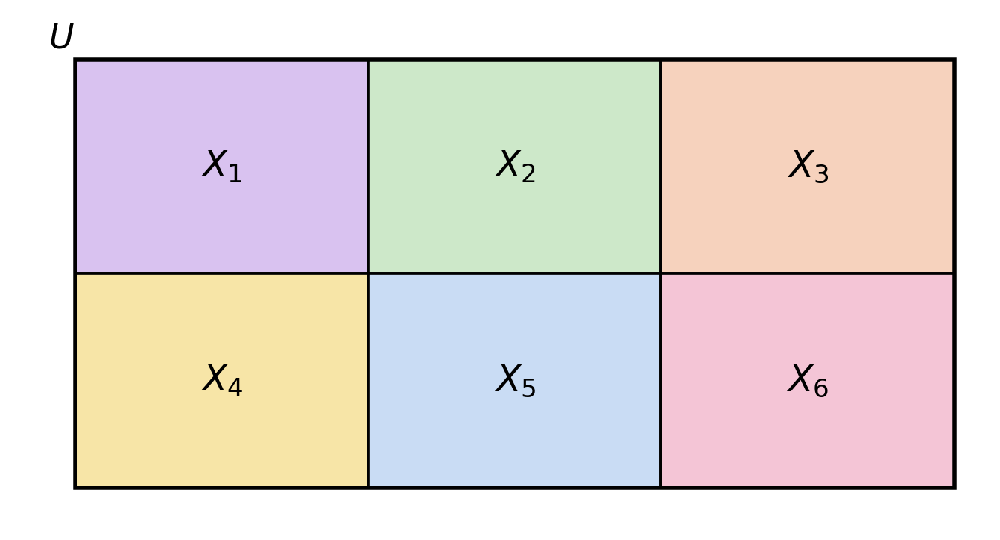

# Lecture 1: Modelling, Sets, and Algebra



Most of the mathematics here are not new and its likely that you have met it before. The aim is to refresh your memory and get you ready for the first class.

------------------------------------------------------------------------

## What a mathematical model is

A **mathematical model** is a simplified description of a real-world situation, written in symbols. We say simplified because a mathematical model leaves things out on purpose. For example, a model of a delivery network that accounted for every pothole would be useless, because it will be impossible to solve.

The mathematical model is represented by an equation between variables and parameters. A **parameter** is a quantity whose value is settled before you solve the model. It is either an input given in the problem statement, measured, or estimated from the data. A **variable** is a quantity whose value is produced by solving the model, or supplied by an observation.\
\
Consider a straight-line relationship $y = \beta_0 + \beta_1 x$. If you are a manager who has been handed $\beta_0 = 12$ and $\beta_1 = 3$ and asked to predict $y$ when $x = 20$, then $\beta_0, \beta_1$ are **parameters** and $y, x$ are **variables**.

### The components of an optimization problem (decision model)

::: {.callout-tip title="Example" icon="false"}
A company manufactures two products, $A$ and $B$. It must determine the quantities to produce each week in order to maximize its profit.

Product $A$ generates a profit of \$30 per unit and requires 2 hours of labor. Product $B$ generates a profit of \$20 per unit and requires 1 hour of labor. The company has 100 labor hours available per week. Because of demand limitations, it cannot sell more than 40 units of $A$ or more than 70 units of $B$.

**Setting up the mathematical model:**

What are the variables? How much of each product to make.

$$x_A = \text{units of } A \text{ produced per week}, \qquad x_B = \text{units of } B \text{ produced per week}.$$

What are the parameters? The unit profits \$30 and \$20, the labor times of 2 hours and 1 hour, the weekly capacity of 100 hours, and the demand ceilings of 40 and 70 units.

What is our goal? Maximize the profit. The profit is an expression built of the variables and parameters.

$$\text{maximize} \quad 30x_A + 20x_B.$$

This could grow to infinity without bound. In reality, however, both the company's resources and its market are limited. Thus, we define the following constraints:

Each unit of $A$ consumes 2 hours and each unit of $B$ consumes 1 hour, and only 100 hours exist:

$$2x_A + x_B \leq 100.$$

Moreover, we cannot sell more than 40 units of $A$ or more than 70 units of $B$. Of course, the number of units produced cannot be negative!

$$x_A \leq 40, \qquad x_B \leq 70, \qquad x_A \geq 0, \quad x_B \geq 0.$$

The last components of the model to be defined are the assumptions. Earlier we mentioned that the mathematical model is a simplified representation as we cannot realistically account for all possibilities. However, in order for the problem to be solvable and for us to be confident in the solution, some assumptions need to be made. For instance, in this example we may assume that the profit per unit is constant, that we know the production times, that we know the maximum demand, and that each unit produced can be sold.\
\
This is all the information we need to solve the model. A clear definition of the problem is crucial and must come before attempting to solve it. We will defer solving this problem to later classes.
:::

Below we summarize the components of an optimization problem as we saw them in the example.

| Component | What it is | In the example |
|:-----------------------|:-----------------------|:-----------------------|
| **Decision variables** | The quantities you choose. Unknown before solving. | $x_A$, $x_B$ |
| **Parameters** | Values handed to you. Known before solving. | unit profits 30 and 20; labor times 2 h and 1 h; capacity 100 h; demand ceilings 40 and 70 |
| **Objective function** | The single number you are making as large or as small as possible. | $30x_A + 20x_B$, maximized |
| **Constraints** | Equations and inequalities every admissible answer must satisfy. | $2x_A + x_B \leq 100$; $x_A \leq 40$; $x_B \leq 70$; $x_A, x_B \geq 0$ |
| **Assumptions** | Simplifications that make the problem solvable, and that you should be prepared to defend. | unit profits constant; labor times known; maximum demand known; every unit produced can be sold |

::: callout-caution
Some assumptions are necessary for the validity of the solution even though they are not necessary to obtain a solution. For example, we will obtain a solution to the problem regardless of whether we assume that every unit produced can be sold. However, our solution is valid only under this assumption. Assumptions allow us to simplify the problem and, in particular, the objective function. But we must state them clearly, as they affect the interpretation of the results.
:::

### Deterministic and probabilistic models

In the example above, the model is **deterministic** because profits, production times, capacity and maximum demand are assumed to be known with certainty. That is a strong assumption. If some of these data were uncertain, then the model would become **probabilistic**. For example, recall that we assumed a demand ceiling of 40 units for product $A$. Now, if we assume instead that the demand for product $A$ follows a normal distribution with mean $40$ and standard deviation of $5$, then the demand for product $A$ will be represented by the random variable:

$$D_A \sim \normal(40, 5^2).$$

The company would then have to choose its production level while accounting for the risk of producing more than the realized demand.

::: callout-caution
In the notation $\normal(\mu, \sigma^2)$ the **second argument is the variance, not the standard deviation**. Writing $\normal(40, 5^2)$ means a standard deviation of 5. Some software, including R's `rnorm`, takes the standard deviation as its argument instead, which is a frequent source of error when moving between a formula and code.
:::

### Statistical models {#sec-stat-model}

In the previous example, profits per unit were given to us. We said earlier that model parameters are either known in advance or estimated. A statistical model allows us to estimate those parameters from observed data and to say how much we trust them.

::: {.callout-tip title="Example" icon="false"}
Suppose we want to explain a company's sales as a function of its advertising expenditures. For period $i$ we record sales $Y_i$ and advertising spend $X_i$, and propose

$$Y_i = \beta_0 + \beta_1 X_i + \varepsilon_i, \qquad \varepsilon_i \sim \normal(0, \sigma^2).$$

where

- $\beta_0$ is baseline sales. This is what the model says would be sold with no advertising at all.
- $\beta_1$ is the effect of advertising. That is, the change in sales associated with one extra dollar spent.
- $\varepsilon_i$ is everything the model does not capture, for example, a competitor's promotion, the weather, a supply problem. It is not an error in the sense of a mistake; it is the part of $Y_i$ that advertising does not explain.
- $\sigma^2$ is the error variance, measuring how much that unexplained part varies.
:::

::: {.callout-note title="Definition:"}
In a statistical model, the **response variable** (also called the **dependent variable**) is the quantity the model sets out to explain or predict. It sits on the left-hand side.

An **explanatory variable** (also called an **independent variable**, a *predictor*, a *regressor*, or a *covariate*) is a quantity used to explain the variation in the response.
:::

In the sales model, $Y_i$ is the response and $X_i$ is the explanatory variable. The quantities $\beta_0$ and $\beta_1$ are the model parameters. Generally, we would have a limited number of observations of pairs $(Y_i, X_i)$ which we use to estimate the model parameters as well as the error variance. Then, we use the estimated parameters and the explanatory variable(s) to predict future values of the response. One final note: the names "dependent" and "independent" are somewhat misleading, as they have nothing to do with statistical independence.

## Sets and subsets

A **set** is a well-defined unordered collection of distinct objects, called **elements**. Sets are useful because so many things are naturally collections, for example, a population, the domain of a variable, the set of feasible decisions, a set of observations.

We write $x \in A$ for "$x$ belongs to the set $A$", and $x \notin A$ for "$x$ does not belong to $A$". We first present some basic mathematical notation that we will rely on for the rest of the course. Here, lower-case letters denote scalars ($a,b,x$), and $P$ and $Q$ are statements. Statements could be mathematical relationships (e.g., $a=b$) or just plain English (e.g., this course is fun).

### Basic mathematical notation

| Symbol | Reading | Example |
|:-----------------------|:-----------------------|:-----------------------|
| $a = b$ | $a$ is equal to $b$ | $x = 3$ |
| $a \neq b$ | $a$ is not equal to $b$ | $x \neq 0$ |
| $a < b$ | $a$ is less than $b$ | $x < 10$ |
| $a \leq b$ | $a$ is less than or equal to $b$ | $x \leq 10$ |
| $a > b$ | $a$ is greater than $b$ | $x > 10$ |
| $a \geq b$ | $a$ is greater than or equal to $b$ | $x \geq 10$ |
| $a \in A$ | $a$ belongs to the set $A$ | $\sqrt{2} \in \R$ |
| $a \notin A$ | $a$ does not belong to $A$ | $-1 \notin \N$ |
| $\forall x$ | for every $x$, for all $x$, for any $x$ | $\forall x \in \R$ |
| $\exists$ | there exists | $\exists x > 0$ |
| $\Rightarrow$ | implies | $P \Rightarrow Q$ |
| $\Leftrightarrow$ | is equivalent to, if and only if | $P \Leftrightarrow Q$ |

$\R$ and $\N$ are the sets of real and natural numbers, respectively. We will introduce them below along with other standard number sets. First, let's look at the last two in the table above.

::: {.callout-tip title="Example" icon="false"}
**An implication.** Let total revenue be

$$R = pq,$$

where $p$ is unit price and $q$ is quantity sold. If the selling price rises while demand is unchanged, then revenue increases:

$$\big(p_1 > p_0 \ \text{ and } \ q_1 = q_0\big) \implies R_1 > R_0.$$

The arrow runs one way only. The opposite does not necessarily hold. That is, observing $R_1 > R_0$ does *not* let you conclude the price went up.
:::

::: {.callout-tip title="Example" icon="false"}
**An equivalence.** Let revenue and cost be

$$R = pq, \qquad C(q) = C_f + C_v q,$$

with $C_f$ the fixed cost and $C_v$ the variable cost per unit. A company reaches its break-even point exactly when revenue equals total cost:

$$\text{break-even reached} \iff pq = C_f + C_v q.$$

Here the arrow runs both ways: break-even implies the equation, and the equation implies break-even.
:::

### Describing a set

A set can be defined in three main ways.

::: {.callout-note title="Definition:"}
**a) By enumeration** $$A = \{1, 2, 3, 4\}.$$ The set $A$ contains exactly the elements 1, 2, 3 and 4.

**b) By a property** (set-builder notation) $$B = \{\, x \in \R \mid x \geq 0 \,\}, \qquad C = \{\, x \in \R \mid a \leq x \leq b \,\}.$$ The vertical bar is read "such that". $B$ is the set of non-negative real numbers; $C$ is the set of reals between $a$ and $b$ inclusive.

**c) By an interval**

We provide an interval defined by a starting and end points and we include all the values in-between. More examples below.
:::

Enumeration is only practical for small finite sets. Set-builder notation is essential because it makes it possible to define precisely which values a variable is allowed to take. It usually has the structure of first defining a general set of admissible values followed by one or more conditions.

$$\underbrace{\{\, x \in \R}_{\text{where } x \text{ lives}} \ \mid \ \underbrace{x \geq 0}_{\text{the condition}} \,\}$$

Finally, intervals are defined by a region with a starting point and an end point. Everything between those two points is included. The inclusion or exclusion of the endpoints is decided by the type of brackets. In the table below we show the different ways we write intervals. Notice that infinity always takes a round bracket because infinity is not a number.

| Interval form  | Set-builder form                    | Endpoints included? |
|:---------------|:------------------------------------|:--------------------|
| $[a, b]$       | $\{x \in \R \mid a \leq x \leq b\}$ | both                |
| $(a, b)$       | $\{x \in \R \mid a < x < b\}$       | neither             |
| $[a, b)$       | $\{x \in \R \mid a \leq x < b\}$    | left only           |
| $(a, b]$       | $\{x \in \R \mid a < x \leq b\}$    | right only          |
| $[a, +\infty)$ | $\{x \in \R \mid x \geq a\}$        | left only           |
| $(-\infty, a]$ | $\{x \in \R \mid x \leq a\}$        | right only          |

Below, we show a representation of intervals on the real line.

{#fig-intervals width="90%"}

In @fig-intervals, $A = [-4, -2]$, $B = [0, 1)$ and $C = (2, 5)$. The number $-3$ is an **interior point** of $A$ because it lies in $A$ with a little room on both sides, unlike the endpoints $-4$ and $-2$. Note that $B$ contains $0$ but not $1$, and that $C$ contains neither $2$ nor $5$.

### The standard number sets

We briefly mentioned the sets of real and natural numbers earlier. The table below presents the standard number sets commonly used.

| Notation | Name | Example of use |
|:-----------------------|:-----------------------|:-----------------------|
| $\N$ | natural numbers | $0, 1, 2, 3, \dots$; number of customers, products, periods |
| $\Z$ | integers | $\dots, -2, -1, 0, 1, 2, \dots$; integer changes up or down |
| $\Q$ | rational numbers | fractions $p/q$ with $p, q \in \Z$, $q \neq 0$; exact proportions |
| $\R$ | real numbers | numbers on the real line; return, temperature, profit |
| $\Rp$ | non-negative reals | $[0, +\infty)$; prices, costs, revenues, probabilities |
| $\R^p$ | real vectors of dimension $p$ | $\vect{x} = (x_1, \dots, x_p)$; one observation on $p$ variables |
| $\R^{n \times p}$ | real $n \times p$ matrices | a whole data set: $n$ observations, $p$ variables |

### Absolute value of a number

::: {.callout-note title="Definition:"}
The absolute value of a real number $a$, written $\abs{a}$, is $$\abs{a} = \begin{cases} a, & \text{if } a \geq 0, \\ -a, & \text{if } a < 0. \end{cases}$$

*That is, we remove the sign. The absolute value is how far the number is from zero, and distance is never negative.*
:::

For example,

$$\abs{13} = 13, \qquad \abs{-13} = -(-13) = 13, \qquad \left\lvert -\tfrac{1}{2} \right\rvert = \tfrac{1}{2}, \qquad \abs{0} = 0.$$

#### Distance between two real numbers

::: callout-important
Let $x_1$ and $x_2$ be real. The distance between them on the real line is $$d(x_1, x_2) = \abs{x_1 - x_2}.$$ Distance is always non-negative, and it is zero exactly when the two numbers are equal: $$d(x_1,x_2) \geq 0, \qquad d(x_1,x_2) = 0 \iff x_1 = x_2.$$ For $a > 0$, $$\abs{x} < a \iff -a < x < a \iff x \in (-a, a), \qquad \abs{x} \leq a \iff x \in [-a, a].$$

*That is, we can say that "*$x$ is within $a$ of zero" and "$x$ lies in the interval of width $2a$ centred at zero".
:::

### Summation notation (sigma)

Summation notation is shorthand for addition.

::: {.callout-note title="Definition:"}
$$\sum_{i=1}^{n} a_i = a_1 + a_2 + \cdots + a_n.$$

The letter $i$ is the **index** and the numbers above and below $\sum$ are the limits.
:::

Economists frequently use census data. Suppose a country is divided into six regions and $N_i$ denotes the population of region $i$. The country's total population is then

$$N_1 + N_2 + N_3 + N_4 + N_5 + N_6 = \sum_{i=1}^{6} N_i.$$

Here are more examples of summation

$$\sum_{i=1}^{4} x_i = x_1 + x_2 + x_3 + x_4, \qquad \sum_{j=2}^{5}(2j-1) = 3 + 5 + 7 + 9 = 24, \qquad \sum_{k=1}^{n} c = \underbrace{c + \cdots + c}_{n \text{ terms}} = nc.$$

#### Example: price index

::: {.callout-tip title="Example" icon="false"}
Suppose the prices of several goods vary over time in an economy. Price indices are used to summarize the overall effect of these changes.

Consider a basket containing $n$ goods. For each good $i = 1, \dots, n$ let

$$\begin{aligned}&q_i = \text{quantity of good } i \text{ in the basket},\\&  p_i^0 = \text{unit price of good }i\text{ in the base year } 0, \\
& p_i^t = \text{unit price of good } i \text{ in year } t.\end{aligned}$$

**Cost of the basket in the base year.** The total cost of the basket in year $0$ is the sum of the product of quantities times their prices in year $0$:

$$p_1^0 q_1 + p_2^0 q_2 + \cdots + p_n^0 q_n = \sum_{i=1}^{n} p_i^0 q_i.$$

**Cost of the same basket in year** $t$. We do the same but we replace the prices at year $0$ with the prices at year $t$:

$$\sum_{i=1}^{n} p_i^t q_i.$$

**The price index.** The price index for the base year is set equal to 100, so the price index for year $t$ is

$$I_t = \frac{\sum_{i=1}^{n} p_i^t q_i}{\sum_{i=1}^{n} p_i^0 q_i} \times 100.$$

**Interpretation.**

- If $I_t = 100$, the cost of the basket has not changed.
- If $I_t > 100$, it has increased.
- If $I_t < 100$, it has decreased.
- If $I_t = 150$, the basket costs 150% of its base-year cost. In other words, prices have risen by $150 - 100 = 50\%$.
:::

#### Summation rules

The following properties are useful when manipulating sums.

::: callout-important
For any numbers $a_i, b_i$ and any constant $c$ (a value not depending on the index):

$$\textbf{Additivity:} \quad \sum_{i=1}^{n}(a_i + b_i) = \sum_{i=1}^{n} a_i + \sum_{i=1}^{n} b_i$$

$$\textbf{Homogeneity:} \quad \sum_{i=1}^{n} c\,a_i = c\sum_{i=1}^{n} a_i$$
:::

It is important to note that there is no product rule. That is,

$$\sum a_i b_i \neq \left(\sum a_i\right)\left(\sum b_i\right), \qquad \sum a_i^2 \neq \left(\sum a_i\right)^2.$$

#### Example: arithmetic mean and deviations from the mean

::: callout-note
The arithmetic mean of $n$ numbers $x_1, x_2, \dots, x_n$ is their sum divided by $n$: $$\xbar = \frac{1}{n}\sum_{i=1}^{n} x_i.$$
:::

Multiplying through by $n$ gives a form we use constantly in derivations:

$$\sum_{i=1}^{n} x_i = n\xbar,$$

and as a result we have (show the derivation as an exercise)

$$\sum_{i=1}^{n}(x_i - \xbar) = 0.$$

The quantity $x_i - \xbar$ is the deviation of observation $i$ from the mean. Because the deviations always sum to zero, they cannot be used as a measure of spread. To measure the spread of the observations, we square these deviations. In particular[,]{style="color:#128a3a"} we have that (show the derivation as an exercise)

$$\sum_{i=1}^{n}(x_i - \xbar)^2 = \sum_{i=1}^{n} x_i^2 - n\xbar^{\,2}.$$

#### Double sums

It is often necessary to combine two or more summation symbols. For example, when data are arranged in a grid (matrix), two indices are needed: $a_{ij}$ for row $i$, column $j$. Consider a matrix with $m$ rows and $n$ columns, and let $S_i$ be the total of row $i$:

$$
\begin{array}{ccccl}
a_{11} & a_{12} & \cdots & a_{1n} & \longrightarrow \ \sum_{j=1}^{n} a_{1j} = S_1 \\
a_{21} & a_{22} & \cdots & a_{2n} & \longrightarrow \ \sum_{j=1}^{n} a_{2j} = S_2 \\
\vdots & \vdots & & \vdots & \\
a_{m1} & a_{m2} & \cdots & a_{mn} & \longrightarrow \ \sum_{j=1}^{n} a_{mj} = S_m
\end{array}
$$

Adding the row totals gives the grand total, and the same grand total is reached by adding column totals instead:

$$S_1 + S_2 + \cdots + S_m = \sum_{i=1}^{m} S_i = \sum_{i=1}^{m}\sum_{j=1}^{n} a_{ij} = \sum_{j=1}^{n}\sum_{i=1}^{m} a_{ij}.$$

### Subsets, cardinality, and set operations

::: {.callout-note title="Definition:"}
A set $A$ is a **subset** of $B$ if every element of $A$ also belongs to $B$: $$A \subseteq B \iff \forall x, \ x \in A \Rightarrow x \in B.$$

We say that the set $A$ is **strictly a subset** of $B$ if every element of $A$ belongs to $B$ while $B$ being larger than $A$:

$$A \subset B \iff (\forall x, \ x \in A \Rightarrow x \in B) \text{ and } (\exists x \in B \Rightarrow x \notin A).$$
:::

Some of the standard sets we defined earlier are subsets of one another. For example[,]{style="color:#128a3a"} we have $\N \subset \Z \subset \Q \subset \R$. This means that every integer is rational (write $-3$ as $-3/1$) and every rational is real. The reverse fails, for example, $\sqrt{2}$ and $\pi$ are real but not rational.\
Note: Think of the difference between $\subseteq$ and $\subset$ as the difference between $\leq$ and $<$ for numbers.

Two further terms:

- The **universal set** $U$ is the reference set within which we are working.
- The **cardinality** of a finite set $A$, written $\card{A}$, is its number of elements.

So $\card{\{1,2,3,4\}} = 4$, and $\card{\varnothing} = 0$ where $\varnothing$ is the **empty set**.

Let $A$ and $B$ be two subsets of a universal set $U$.

| Operation | Notation | Definition | Management interpretation |
|:-----------------|:-----------------|:-----------------|:-----------------|
| Union | $A \cup B$ | $\{x \in U \mid x \in A \text{ or } x \in B\}$ | customers in at least one of the two segments |
| Intersection | $A \cap B$ | $\{x \in U \mid x \in A \text{ and } x \in B\}$ | customers in both segments simultaneously |
| Difference | $A - B = A \cap B^c$ | $\{x \in U \mid x \in A \text{ and } x \notin B\}$ | customers in $A$ but not in $B$ |
| Complement | $A^c = U - A$ | $\{x \in U \mid x \notin A\}$ | customers in the universe who are not in $A$ |

#### Cartesian product and multidimensional observations

::: {.callout-note title="Definition:"}
The Cartesian product of two sets $A$ and $B$ is the set of ordered pairs whose first component belongs to $A$ and whose second belongs to $B$: $$A \times B = \{(a, b) \mid a \in A, \ b \in B\}.$$
:::

In a data set, an individual is usually described by several variables at once, and is therefore represented by a vector:

$$\vect{x}_i = \left(x_{i1}, x_{i2}, \dots, x_{ip}\right) \in \R^p,$$

where $p$ is the number of variables measured for individual $i$.

::: {.callout-tip title="Example" icon="false"}
A Netflix user may be represented by a vector containing age, the number of hours watched per week, a preferred movie genre encoded numerically, the number of series abandoned before completion, and the user's average rating of content. This five-dimensional vector, with $p = 5$ variables, lets a recommendation algorithm compare the user with others who have similar profiles.
:::

#### Partition of a universal set

::: {.callout-note title="Definition:"}
Let $X_1, X_2, \dots, X_k$ be non-empty subsets of $U$. The family $\{X_i\}_{i \in \{1,2,\dots,k\}}$ forms a **partition** of $U$ if

$$\bigcup_{i=1}^{k} X_i = U,$$ and $$\qquad X_i \cap X_j = \varnothing \ \text{ for every } i \neq j,$$

where

$$\bigcup_{i=1}^{k} X_i = X_1 \cup X_2 \cup X_3 \cup \cdots \cup X_k.$$

*That is, the subsets split* $U$ into pieces with no gaps or overlaps[,]{style="color:#128a3a"} and every element in $U$ belongs to exactly one piece.
:::

{#fig-partition width="65%"}

## Essential algebra for working with models

Algebra allows us to simplify expressions and solve equations.

### Algebraic expressions

An algebraic expression combines numbers, variables and operations. The basic manipulations are as follows[:]{style="color:#128a3a"}

| Operation | Formula | Purpose |
|:-----------------------|:-----------------------|:-----------------------|
| Combine like terms | $2x + 3x = 5x$ | group like terms |
| Expand | $a(b + c) = ab + ac$ | remove parentheses |
| Factor | $ab + ac = a(b + c)$ | factor out a common factor |
| Square of a sum | $(a+b)^2 = a^2 + 2ab + b^2$ | simplify quadratic functions |
| Difference of squares | $a^2 - b^2 = (a-b)(a+b)$ | solve or factor expressions |

### Polynomials and quadratic equations

A polynomial of degree $n$ is an expression of the form

$$P(x) = a_n x^n + a_{n-1}x^{n-1} + \cdots + a_1 x + a_0, \qquad a_n \neq 0.$$

**Examples.**

- $P(x) = 3x + 1$: a polynomial of degree 1.
- $P(x) = 2x^2 - 3x + 1$: a polynomial of degree 2.
- $Q(x) = 5x^3 + x - 7$: a polynomial of degree 3.

#### Roots of a first-degree polynomial

A linear equation in one unknown is written as

$$ax + b = 0, \qquad a \neq 0,$$

with the single solution

$$x = -\frac{b}{a} = -a^{-1}b.$$

#### Roots of a quadratic polynomial

A quadratic equation is written $$ax^2 + bx + c = 0, \qquad a \neq 0,$$ and its discriminant is $$\Delta = b^2 - 4ac.$$

- If $\Delta > 0$, there are two distinct real roots: $$x_1 = \frac{-b - \sqrt{\Delta}}{2a}, \qquad x_2 = \frac{-b + \sqrt{\Delta}}{2a}.$$

- If $\Delta = 0$, there is one repeated real root: $$x = -\frac{b}{2a}.$$

- If $\Delta < 0$, there is no real root.

*That is, the discriminant tells us whether we have two, one, or no real solutions.*

### Exponents and logarithms

For $a, b > 0$ and compatible exponents, the basic rules are

$$a^m a^n = a^{m+n}, \qquad \frac{a^m}{a^n} = a^{m-n}, \qquad (a^m)^n = a^{mn},$$

$$(ab)^n = a^n b^n, \qquad a^{-n} = \frac{1}{a^n}, \qquad a^0 = 1.$$

For equations with the same positive base $a \neq 1$,

$$a^f = a^g \iff f = g, \qquad \text{and in particular} \qquad e^f = e^g \iff f = g.$$

::: callout-warning
$a^m a^n = a^{m+n}$, **not** $a^{mn}$.
:::

The logarithm to base $a > 0$, with $a \neq 1$, is defined by $$\log_a(x) = y \iff a^y = x.$$ The **natural logarithm** is written $\ln$ and corresponds to base $e$: $$\ln(x) = y \iff e^y = x.$$

*That is, a logarithm answers "what power do I raise the base to, in order to get* $x$?"

Useful rules include

$$\ln(xy) = \ln x + \ln y, \qquad \ln\!\left(\frac{x}{y}\right) = \ln x - \ln y, \qquad \ln(x^r) = r\ln x,$$

$$\ln(e) = 1, \qquad \ln(1) = 0, \qquad \ln(e^x) = x, \qquad e^{\ln x} = x \ \ (x > 0).$$

And for equations,

$$\log_a(f) = \log_a(g) \iff f = g, \qquad \text{in particular} \qquad \ln(f) = \ln(g) \iff f = g.$$

::: callout-warning
The notation "$\log$" can sometimes be ambiguous. In R and most mathematical writing, `log(x)` is the natural logarithm[.]{style="color:#128a3a"} However, in calculators, `LOG` means base 10. These notes always write $\ln$ for the natural log and always show the base otherwise. Moreover, there is no rule for the logarithm of a sum: $$\ln(x + y) \neq \ln x + \ln y.$$
:::

#### Example: exponential growth and decay

::: callout-important
An initial quantity $Q_0$ that **increases** by $p\%$ each year has, after $t$ years, the value $$Q_0\left(1 + \frac{p}{100}\right)^{t}.$$ An initial quantity $Q_0$ that **decreases** by $p\%$ each year has, after $t$ years, the value $$Q_0\left(1 - \frac{p}{100}\right)^{t}.$$ The number $1 + p/100$ is the **growth factor** associated with an increase of $p\%$; the number $1 - p/100$ is the **decay factor** associated with a decrease of $p\%$. Here $Q_0$ is the initial value, $p$ the annual rate as a percentage, and $t$ the number of years.
:::

The factor is *multiplied* repeatedly rather than added because each year's change applies to the new total (compounded), not to the original.

::: {.callout-tip title="Example" icon="false"}
A new car was purchased for \$30,000. Assume its value decreases by 15% per year. What will its value be after six years?

The rate is a decrease, so the decay factor is

$$1 - \frac{15}{100} = 0.85.$$

After six years the value is

$$30000 \times (0.85)^6 = 30000 \times 0.377150 \approx \$11{,}314.49.$$
:::

::: {.callout-tip title="Example" icon="false"}
A sum of \$5,000 deposited in an account grew to \$10,000 after 15 years. What constant annual interest rate $p$ was applied?

Set up the growth equation with the rate unknown:

$$5000\left(1 + \frac{p}{100}\right)^{15} = 10000,$$

Or equivalently,

$$\left(1 + \frac{p}{100}\right)^{15} = 2.$$

The final solution for $p$ is $p\approx 4.73\%$.
:::

------------------------------------------------------------------------